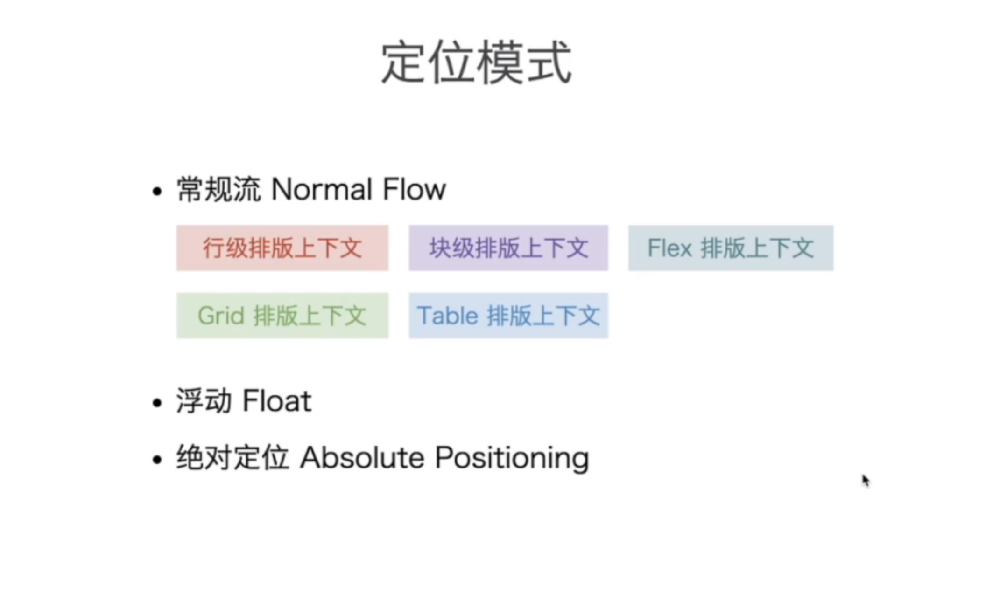
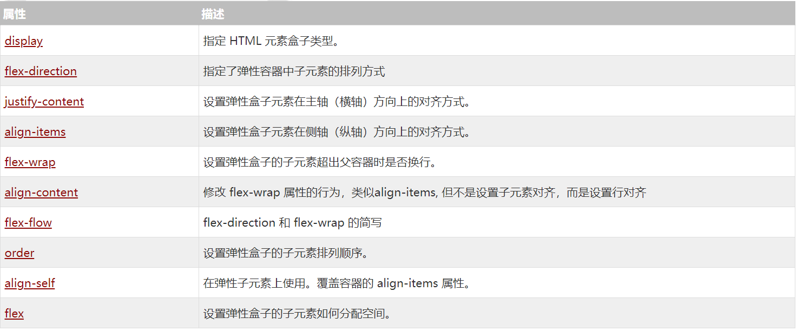
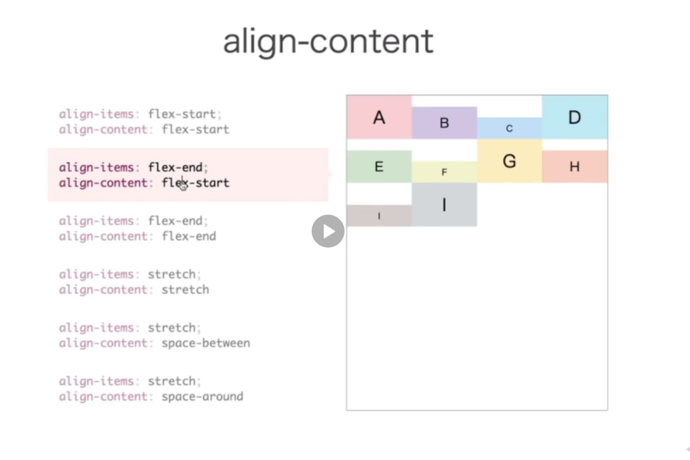
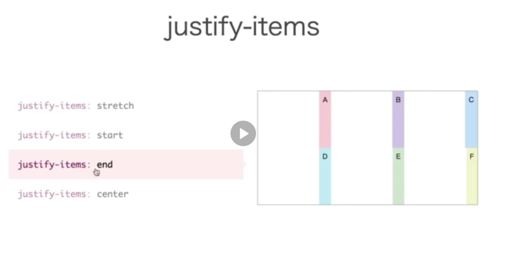
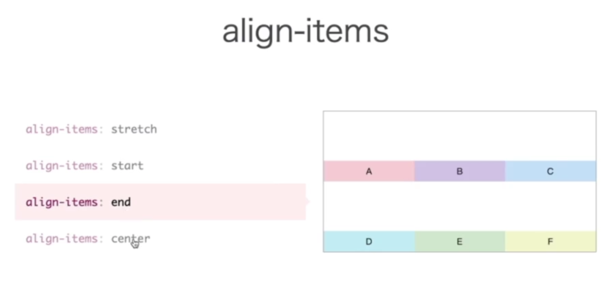
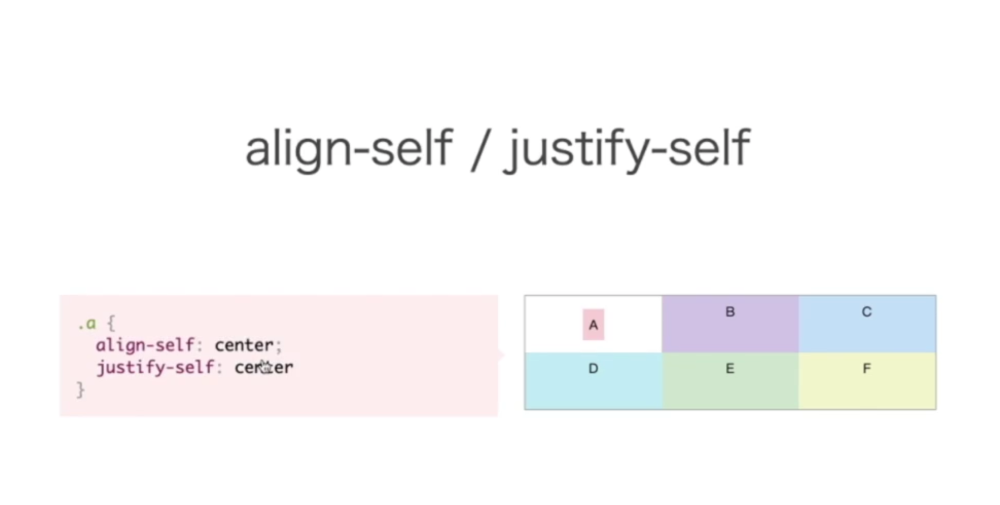
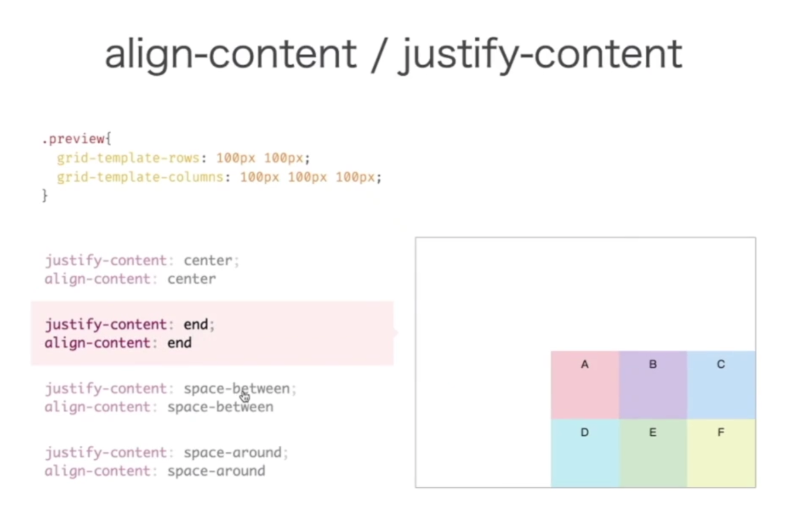

# CSS布局

（浮动元素脱离了常规流，就相当于不在一个次元了，absolute也是）

# Flex-BOX

flex属性很多，可以参考
[学长的优质博客](http://www.ruanyifeng.com/blog/2015/07/flex-grammar.html)
[W3C](https://www.w3cschool.cn/css3/2h6g5xoy.html)

但是关于flex-grow和flex-shrink我感觉他们将的都不太清楚

- **flex-grow**：**子项上设置**。分配剩余空间给项目。当弹性盒子中的项目按项目自身的width排列完后，如果有剩余空间，那么就按照flex-grow的值进行等比例的伸展。比如A、B、C的值分别是1、2、1，那么就将剩余空间的值按照1：2：1的比例分给ABC。注意这是在分配剩余空间，如果没有剩余空间则没效果。默认值为0，即不进行伸展。

- **flex-shrink**：**子项上设置**。收缩项目空间。当弹性盒子中的项目的宽/高超过弹性盒子自身时，通过flex-shrink的值进行收缩。比如说ABC的shrink值分别为1、2、1（注意这里的条件是三个盒子的总宽高值超过弹性盒子时），这里就进行按比例收缩直至刚好不超过盒子为准。动态的来理解如何收缩的话就是，AC按1的速度收缩，B按2的速度收缩，他们是同事进行的，当他们刚好不超过弹性盒子时，收缩停止（可以想象成压缩弹簧，只是压缩的速度不同）。默认值为1，即默认会进行等比例的收缩。（提一嘴，这是没设置换行（nowrap）时，如果设置了换行那就直接换了，但不得不感叹弹性盒子真方便，功能齐全。.）

- **align-content**: 当弹性盒子中的项目有**多行**时才会有效。其效果是定义项目在盒子空间整体上的排列情况。比如设置为`flex-start`那么整体上就是靠上的。这时的`align-items`属性用于设置每一行的项目排列情况（单行成什么排列，纵向上）。
比如这个例子：

# Grid-Box

>grid;grid-template-columns;grid-template-rows;grid-template-areas;grid-area;

>grid-gap;justify-items;align-items;justify-self;align-self;justify-content;align-content;

- **justify-items,align-items**:前者设置网格内部横向上的摆放（类似于flex中的justify-content），后者为纵向。注意这俩都是总体范围上的，即设置全部网格。至于如何设置单个看下一条。

- **justify-self;align-self**：设置单个网格的摆放。

- **justify-content;align-content**：当网格没有填满整个容器空间时，设置整个网格区域（把网格区域当做一个block）的摆放。

# Position

relative在常规流中通过top、right、bottom、left来定位，其定位后不会对其他元素的定位产生影响（不会挤别人）。absolute也是脱离了常规流，不会对流内其他元素产生影响。（根元素是指html标签）