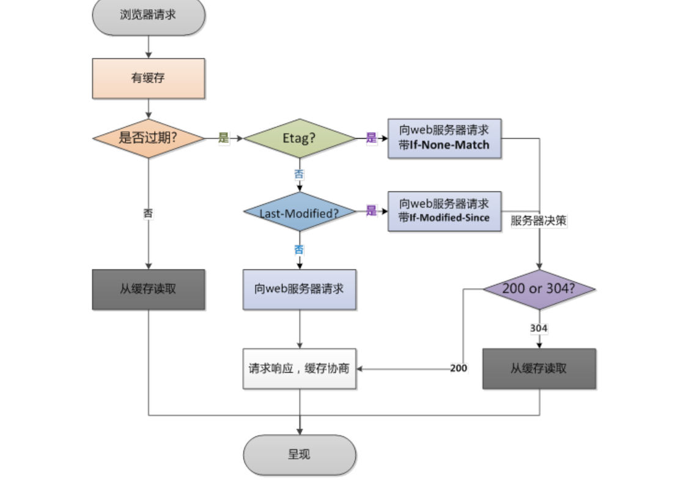

# 缓存

## [MDN-HTTP缓存](https://developer.mozilla.org/zh-CN/docs/Web/HTTP/Caching)：max-age是相对于请求发送时间，相当于一个倒计时，计算过期时间

### 新鲜度：会定时清理缓存

>理论上来讲，当一个资源被缓存存储后，该资源应该可以被永久存储在缓存中。由于缓存只有有限的空间用于存储资源副本，所以缓存会定期地将一些副本删除，这个过程叫做缓存驱逐。另一方面，当服务器上面的资源进行了更新，那么缓存中的对应资源也应该被更新，由于HTTP是C/S模式的协议，服务器更新一个资源时，不可能直接通知客户端更新缓存，所以双方必须为该资源约定一个过期时间，在该过期时间之前，该资源（缓存副本）就是新鲜的，当过了过期时间后，该资源（缓存副本）则变为陈旧的。

## [浏览器缓存原理以及本地存储](https://segmentfault.com/a/1190000017185195)：主要讲了缓存的分类，着重讲http缓存、本地缓存

### 强缓存

1. 不会向服务器发起请求，直接从缓存中读取资源
2. 请求返回200的状态码
3. 缓存分为两种：from memory和from disk

expires和cache-control最大的区别在于：expires的过期时间是相对于服务器而言的，而服务器和浏览器时间也许会出现偏差，cache-control通过max-age这个相对于发送时间的返回值来确定过期时间。

### 协商缓存

为什么需要ETag：
1. 一些文件也许会周期性的更改，但是他的内容并不改变(仅仅改变的修改时间)，这个时候我们并不希望客户端认为这个文件被修改了，而重新GET；
2. 某些文件修改非常频繁，比如在秒以下的时间内进行修改，(比方说1s内修改了N次)，If-Modified-Since能检查到的粒度是s级的，这种修改无法判断(或者说UNIX记录MTIME只能精确到秒)；
3. 某些服务器不能精确的得到文件的最后修改时间。

先验证强缓存过期没，没过期直接用，不发请求。如果过期了就验证是否有ETag，如果有，则向web服务器请求带If-None-Match；如果没有ETag，验证是否有Last-Modified，如果有，则向web服务器请求带If-Modified-Since；如果都没有，则直接向web服务器请求。

## [看一下最后一段关于浏览器刷新问题和参考链接的文章](https://zhuanlan.zhihu.com/p/111190645)

### 浏览器刷新问题

>当你点“刷新”按钮的时候，浏览器会在请求头里加一个“Cache-Control: maxage=0”。因为 max-age 是“生存时间”，而本地缓存里的数据至少保存了几秒钟，所以浏览器就不会使用缓存，而是向服务器发请求。服务器看到 max-age=0，也就会用一个最新生成的报文回应浏览器。
>Ctrl+F5 的“强制刷新”又是什么样的呢？
>它其实是发了一个“Cache-Control: no-cache”，含义和“max-age=0”基本一样，就看后台的服务器怎么理解，通常两者的效果是相同的。

>普通刷新会启用弱缓存，忽略强缓存。只有在地址栏或收藏夹输入网址、通过链接引用资源等情况下，浏览器才会启用强缓存，这也是为什么有时候我们更新一张图片、一个js文件，页面内容依然是旧的，但是直接浏览器访问那个图片或文件，看到的内容却是新的。

也就是说，我们平时点刷新的时候，是不会使用缓存中的内容的，但是缓存不会被清理掉，只是单纯的不使用。强制刷新才会清除掉。

## [WEB缓存相关知识整理（全）](https://segmentfault.com/a/1190000009638800)：全部缓存类型都整理了一遍

Cookie在你浏览电商时，忘cookie中记录你要购买的东西，在付款时再统一把cookie中的数据传给后端，这样就省去了服务器的压力。也就是说cookie是在本地先进行存储的，然后随着http请求统一发送给服务器。

