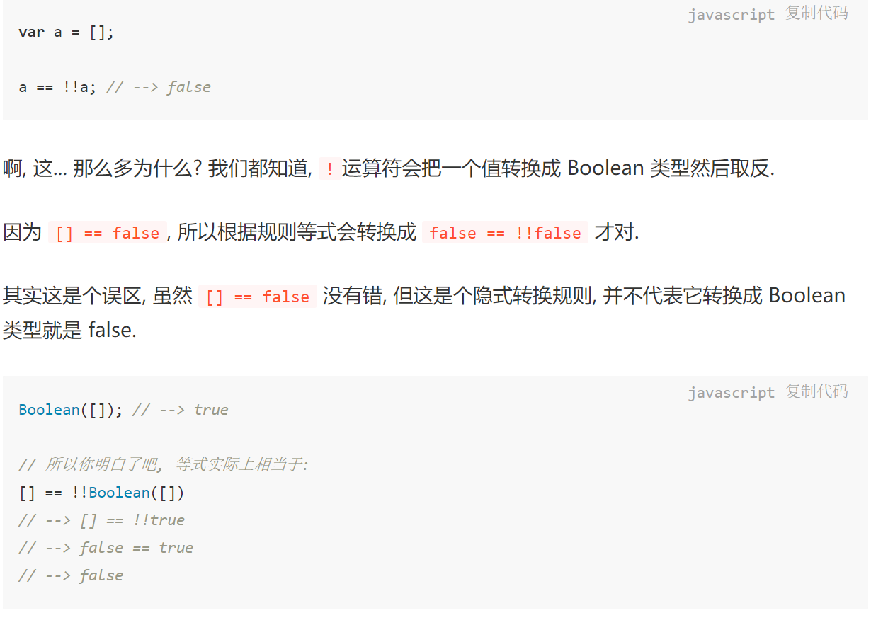
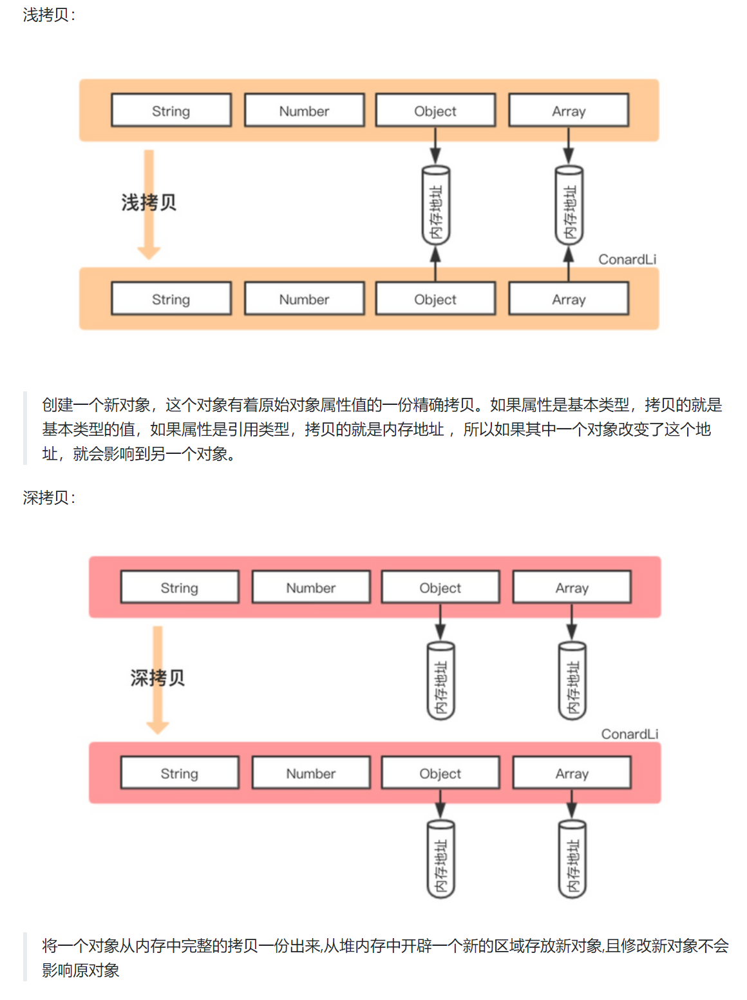

<!-- TOC -->

- [数据类型以及类型转换](#数据类型以及类型转换)
    - [隐式类型转换](#隐式类型转换)
    - [还是靠例子来理解吧，光说估计过几天就看不懂了](#还是靠例子来理解吧光说估计过几天就看不懂了)
    - [==的运算细节](#的运算细节)
    - [转数字](#转数字)
    - [转Boolean](#转boolean)
- [变量类型](#变量类型)
    - [原始类型与引用类型](#原始类型与引用类型)
        - [再谈堆栈](#再谈堆栈)
        - [对变量的复制](#对变量的复制)
        - [比较](#比较)
        - [值传递和引用传递](#值传递和引用传递)
    - [Symbol类型](#symbol类型)
    - [Number类型](#number类型)
        - [为什么0.1+0.2 ！== 0.3](#为什么0102--03)
            - [所以该怎么比较两个浮点数？](#所以该怎么比较两个浮点数)
    - [其他引用类型](#其他引用类型)
        - [包装类型](#包装类型)
        - [装箱和拆箱](#装箱和拆箱)
- [深拷贝](#深拷贝)
- [作用域、上下文、const、var、let](#作用域上下文constvarlet)
    - [作用域](#作用域)
        - [全局作用域、函数作用域](#全局作用域函数作用域)
        - [块级作用域](#块级作用域)
    - [作用域链](#作用域链)
    - [执行上下文](#执行上下文)
        - [生命周期](#生命周期)
            - [创建阶段](#创建阶段)
                - [变量对象（variable object/VO）](#变量对象variable-objectvo)
                - [再谈作用域和作用域链](#再谈作用域和作用域链)
                - [this指向（未完）](#this指向未完)
            - [执行阶段](#执行阶段)
            - [销毁阶段（未完）](#销毁阶段未完)
        - [执行上下文栈](#执行上下文栈)
    - [var、let、const](#varletconst)
        - [差异点](#差异点)
            - [变量提升](#变量提升)
                - [函数提升优先于变量提升](#函数提升优先于变量提升)
                - [函数表达式不会提升](#函数表达式不会提升)
                - [同名函数、同名变量](#同名函数同名变量)
            - [作用域问题](#作用域问题)
            - [暂时性死区](#暂时性死区)
            - [不可重复声明](#不可重复声明)
            - [let、const声明的全局变量不会挂在顶层对象下面（？？？）](#letconst声明的全局变量不会挂在顶层对象下面)
        - [注意点](#注意点)
            - [隐式全局变量不会被提升](#隐式全局变量不会被提升)
            - [var a=b=1;var a=b,b=1;](#var-ab1var-abb1)
            - [经典for循环](#经典for循环)
    - [typeof](#typeof)
- [js执行阶段开了什么（未完待续）](#js执行阶段开了什么未完待续)

<!-- /TOC -->

# 数据类型以及类型转换

[优秀博客，包括隐式类型转换也有在讲](https://juejin.cn/post/6844903854882947080#heading-10)

先放上几篇参考文章：
- [JavaScript专题之类型判断(上)](https://github.com/mqyqingfeng/Blog/issues/28)
- [JavaScript深入之头疼的类型转换(上)](https://segmentfault.com/a/1190000022167898)
- [JavaScript 基本数据类型知识总结](https://juejin.cn/post/6866362567473381383)
- [JS 的类型转换(内有练习题)](https://juejin.cn/post/6844904095774425101#heading-0)

几个概念：
- 内部属性：
>所有 typeof 返回值为 "object" 的对象（如数组）都包含一个内部属性 [[Class]]（我 们可以把它看作一个内部的分类，而非传统的面向对象意义上的类）。这个属性无法直接访问， 一般通过 Object.prototype.toString(..) 来查看。例如：
```
Object.prototype.toString.call( [1,2,3] );  // "[object Array]" 
Object.prototype.toString.call( /regex-literal/i ); //"[object RegExp]"
```

- toString()方法：

当调用对象自身的toString方法时，若对象是Object类型，则会实际上调用prototyp。toString方法，如上所示，另外还有几条规则：

    - 数组的 toString 方法将每个数组元素转换成一个字符串，并在元素之间添加逗号后合并成结果字符串。
    - 函数的 toString 方法返回源代码字符串。
    - 日期的 toString 方法返回一个可读的日期和时间字符串。
    - RegExp 的 toString 方法返回一个表示正则表达式直接量的字符串。

- valueOf()方法：

表示对象的原始值。默认的 valueOf 方法返回这个对象本身，数组、函数、正则简单的继承了这个默认方法，也会返回对象本身。日期是一个例外，它会返回它的一个内容表示: 1970 年 1 月 1 日以来的毫秒数。
```
var date = new Date(2017, 4, 21);
console.log(date.valueOf()) // 1495296000000
```

- 原始值与引用值：

原始值存储在栈中，是简单的数据段，他们的值能够被变量直接访问到。五种原始类型的值都是原始值，包括`Boolean,Number,String,null,undefined`。当对原始值进行复制时（把一个变量复制给另一个新的变量）,实际上此时是复制的栈中的数据，并新开辟了一个新的栈，所以两个原始值是互不影响的。

引用值存储在堆中，变量实际能访问到的是一个指向堆中存储数据的地址。对象类型的值都是引用值，如`Object,Array,Date`等。当对引用值进行复制时，实际上是把自身指向实际值的指针赋值给了新的变量。所以当改变实际值时，两个变量的值都会随之改变。

- 堆栈

这里说到了堆栈，就该继续了解一下这个概念。
[直接看文章](https://www.zhihu.com/question/19729973)


1. Boolean值的比较

基本类型的比较较为简单，略。

若是对象与String、Boolean、Number比较时，会采取隐式类型转换。先调用对象的`valueOf(),toString()`方法后，再进行比较。



比如这个例子，`a==!!a`，实际上等号左边就按上述所说的隐式类型转换进行，而等号右边因为加上！！号，则会被判断为bool值，那么进行转换时，会进行Boolean方法的隐式转换。由于转换为bool类型为false值的只有`+0,-0,null,undefined,'',NaN`，其余都会是true值。

所以来看这个例子，[].valueOf().toString() --> [].toString() --> ''，而等号右边!!a-->!!Boolean([]) --> !!true --> true。此时右边是bool值，则对左边在进行一次隐式转换，即为false了。

2. Number值的比较

主要看NaN：[JavaScript中的 NaN 与 isNaN](https://www.cnblogs.com/onepixel/p/5281796.html)

一个表达式中如果有减号 (-)、乘号 (*) 或 除号 (/) 等运算符时，JS 引擎在计算之前，会试图将表达式的每个分项转化为 Number 类型（使用 Number(x) 做转换）。如果转换失败，表达式将返回 NaN 。

另外，Number（‘a’）会返回一个NaN，默认const a = 'a'则会让a是一个string类型值，但若是加上一元运算符'+'（正号，不是加号，如果是加则会隐式转换到string进行计算），那么+a会返回一个NaN，因为此时会进行Number的转换。

## 隐式类型转换
- 
    
    [一文看懂JS里隐式转换、toString() 和 valueOf()](https://blog.csdn.net/weixin_42752574/article/details/106065486)


## 还是靠例子来理解吧，光说估计过几天就看不懂了

- 例子1：

```js
undefined == false // false。
null == false // false
```
原因是，[StackOvWhy (null == false) and (null == true) both return false?
erflow上的解释](https://stackoverflow.com/questions/27632391/why-null-false-and-null-true-both-return-false)
当 == 两边有boolean值时，会优先转为number值，其中true-->1而false-->+0。

而Number(undefined)-->NaN。Number(null)-->0.

所以 `+null == false // true`

- 例子2：
```js
[] == ![] // true
```
原因在于`!`的优先级要高于`==`。所以先对`![]`进行类型转换。因为`!`是Boolean的方法，所以我们将`[]`转换为Boolean值，即为`true`，因为要对!进行运算，就必须得是Boolean值。然后再按`==`比较。

[MDN运算符优先级](https://developer.mozilla.org/zh-CN/docs/Web/JavaScript/Reference/Operators/Operator_Precedence)
[逻辑运算符](https://zh.javascript.info/logical-operators)：这里有说，逻辑非的作用相当于
1. 将操作数转化为布尔类型：true/false。
2. 返回相反的值。


而`!!`的作用其实就相当于显示转换`Boolean()`。

## ==的运算细节

找了好久，终于找到这个了，真是很有用。
- [知乎链接：为什么null == 0 返回false](https://www.zhihu.com/question/52666420)
- [ECMA中的解释](https://es6.ruanyifeng.com/?search=%E9%80%97%E5%8F%B7&x=4&y=9#docs/spec)

如下：
1. 如果x不是正常值（比如抛出一个错误），中断执行。
2. 如果y不是正常值，中断执行。
3. 如果Type(x)与Type(y)相同，执行严格相等运算x === y。
4. 如果x是null，y是undefined，返回true。
5. 如果x是undefined，y是null，返回true。
6. 如果Type(x)是数值，Type(y)是字符串，返回x == ToNumber(y)的结果。
7. 如果Type(x)是字符串，Type(y)是数值，返回ToNumber(x) == y的结果。
8. 如果Type(x)是布尔值，返回ToNumber(x) == y的结果。
9. 如果Type(y)是布尔值，返回x == ToNumber(y)的结果。
10. 如果Type(x)是字符串或数值或Symbol值，Type(y)是对象，返回x == ToPrimitive(y)的结果。
11. 如果Type(x)是对象，Type(y)是字符串或数值或Symbol值，返回ToPrimitive(x) == y的结果。
12. 返回false。


## 转数字

- Number(null)=0;
- Number(undefined)=NaN

## 转Boolean

只有`+0,-0,null,undefined,'',NaN`为false，其余都为true。


# 变量类型

[你真的掌握变量和类型了吗](https://juejin.cn/post/6844903854882947080)

## 原始类型与引用类型

### 再谈堆栈

栈空间的分配是由系统自动分配的，存储在栈中的数据占用的空间都比较小，可以直接进行操作，运行效率很高。但栈空间中的值是不可改变的。例：
```js
let a=4;
let b=4;//(由于js不能查看内存地址，我其实挺好奇a、b地址到底相不相等，看网上有说其实这种小的值都是自带一个const的，所以他们的地址是相等的)
let c=a；//c之后仍等于一个4，说明值不可变
a=5;//此时对a的值进行改变，但实际上你只是改变了a的指向，在栈中新开辟了一个空间，使它的值为5，而不是对4这个值进行改变的。虽然这个例子似乎无法说明原本a、b的地址是否相等，b此时自然能等于4，如果说地址是相等的，那就说明4这个值并没有改变。如果能看内存地址，看一下a、b地址应该很一目了然
```

堆空间的分配是人为自己指定的，存储在堆中的数据占用的空间一般都比较大，运行效率很低，不能直接进行访问，都是通过引用地址来进行读取的。在堆中存储的值大小不定，是可以动态调整的。

### 对变量的复制

原始类型和引用类型的复制是不一样的。复制原始类型时，都是在栈中新开辟空间，然后把被复制的值存储进去，再让新变量指定它。而引用类型是复制的存储在堆中的地址。这些应该都懂，也忘不了。

[js中对象的赋值、拷贝的区别](https://segmentfault.com/a/1190000021667397)

总结来说就是赋值只是把地址给新变量，新旧变量仍指向同一个堆内存。而拷贝是重新开辟了新空间，浅拷贝的基本类型是独立分开了，引用类型的内存地址还是一样的。深拷贝是全部隔离开来。



### 比较

都是在比较栈中的值，理解这点应该就能懂
```js
let obj = {name:'heool'};
let obj2 = {name:'heool'};
console.log(obj === obj2);//false
```

### 值传递和引用传递

直接给出重点：ECMAScript中函数都是值传递！。

- 原始类型：

```js
let name = 'ConardLi';
function changeValue(name){
  name = 'code秘密花园';
}
changeValue(name);
console.log(name);//ConardLi
```
这个应该好理解，不说了。

- 引用类型：

先上例子：

```js
let obj = {};
function changeValue(obj1){
  obj1.name = 'ConardLi';
  obj1 = {name:'code秘密花园'};
}
changeValue(obj);
console.log(obj.name); // ConardLi
```

这个例子充分说了函数是值传递。引用类型的值传递，实际上传入的是地址，这个地址是指向得堆中的数据。所以我们可以通过这个地址来间接的访问堆中的数据。`obj1 = {name:'code秘密花园'};`其实相当于说，后面大括号内的内容，是新开辟了一个堆空间，然后把obj1指向这个堆，此时obj1的栈空间从原本是obj指向的地址变为了新的这个地址。相当于一个对obj1的栈中值的覆盖。而如果是引用传递，我自己的理解哈，obj1就相当于obj的别称，所以改变地址就能对obj起到效果。而值传递就是会把存储的值给覆盖掉，就像是上面“再谈堆栈”里说的那样：a的值变为了5，而c的值却没变，因为只改变了栈中的值，两个是独立分开的。

## Symbol类型

特性：
- 独一无二：通过Symbol()创建的变量，是绝不相等的。如果想创建两个相等的symbol，可以通过`Symbol.fot(key)`来创建。当参数为对象时，将调用对象的toString()方法。

```js
var sym1 = Symbol();  // Symbol() 
var sym2 = Symbol('ConardLi');  // Symbol(ConardLi)
var sym3 = Symbol('ConardLi');  // Symbol(ConardLi)
var sym4 = Symbol({name:'ConardLi'}); // Symbol([object Object])
console.log(sym2 === sym3);  // false
```

- 原始类型：typeof返回symbol

- 不可枚举：不能通过传统的方法获得其symbol属性，通过`getOwnPropertySymbols()`来获取

```js
var obj = {
  name:'ConardLi',
  [Symbol('name2')]:'code秘密花园'
}
Object.getOwnPropertyNames(obj); // ["name"]
Object.keys(obj); // ["name"]
for (var i in obj) {
   console.log(i); // name
}
Object.getOwnPropertySymbols(obj) // [Symbol(name)]
```

## Number类型

### 为什么0.1+0.2 ！== 0.3

须知，计算机中存储数据都是以二进制存储的，当对数据进行运算时，会先转换为二进制来运算，大多数小数的二进制都是无限循环的，由于存储的原因，就会出现精度缺失的问题。

JS遵循IEEE 754标准存储数据，js使用的是64位双精度浮点数编码。


题外话，符号指符号位，指数位指科学计数法时，指数最大位数，尾数就是平时我们看到并使用的。

而当对数据进行舍位时，会采取1进位的办法，所以在我们存储0.1的时候，其53位恰好为1，舍去后进行进位，也即是52位由0变为1。所以计算出来的0.3和直接由0.3舍位得来的两个值是不同的。所以其实这里就是个巧合，恰好0.1进位，0.2、0.3没进位。0.2+0.6===0.8就是true。

#### 所以该怎么比较两个浮点数？

[Number.epsilon](https://developer.mozilla.org/en-US/docs/Web/JavaScript/Reference/Global_Objects/Number/EPSILON)

Number.epsilon表示一个数字1与大于1的最小的浮点数（因为js采取64位计数，52位是尾数，也就是1.0...1，共50个0）之间的差值。所以比较浮点数方法就变成了比较差值，只要差值比这个数小就是认为是精确的。

```js
const result = Math.abs(0.2 - 0.3 + 0.1);

console.log(result);
// expected output: 2.7755575615628914e-17

console.log(result < Number.EPSILON);
// expected output: true
```

## 其他引用类型

Array、Date、RegExp、Function自不用多说，再来看看其他的。

### 包装类型

比如Number、Boolean、String。通过如`new Number(value)`创建的类型，他们是一个引用类型，也即是Object类型。故`123 === new Number(123) //false`

>引用类型和包装类型的主要区别就是对象的生存期，使用new操作符创建的引用类型的实例，在执行流离开当前作用域之前都一直保存在内存中，而自基本类型则只存在于一行代码的执行瞬间，然后立即被销毁，这意味着我们不能在运行时为基本类型添加属性和方法。

其实上面这句话就是说栈的创建和删除都是系统自动来搞，堆要自己来弄。

### 装箱和拆箱

其实也就是自动的进行一个过程。比如我们操作基础类型时，后台自动装箱一个对象，使得我们可以像访问引用类型那样，使用其方法和属性。

有趣的面试题：如何让`a == 1 && a == 2 && a == 3`。

根据上面的拆箱转换，以及==的隐式转换，我们可以轻松写出答案：
```js
const a = {
   value:[3,2,1],
   valueOf: function () {return this.value.pop(); },
} 
```

重点在于思考过程：为了实现上面的条件，那明显基本类型Number不可能做到，那么只能是引用类型了。引用类型要与基本类型进行`==`比较，那么默认会先调用ValueOf()然后toString()。于是我们可以在这上面下文章。因为有三个值，那显然该用个数组储存，接着对每次都pop掉一个数即可了。

思考过程就是循序渐进，去逆推！

# 深拷贝

[如何写出一个惊艳面试官的深拷贝?](https://segmentfault.com/a/1190000020255831#comment-area)：我只能说一句牛逼

1. 基本的对象、数组类型递归深拷贝（✔）
2. 防止循环引用
3. 优化性能
4. 考虑更多类型


# 作用域、上下文、const、var、let

## 作用域

[深入理解JavaScript作用域和作用域链](https://juejin.cn/post/6844903797135769614#heading-0)
[JavaScript-你可能不了解的块级作用域](https://juejin.cn/post/6844903951351939080#heading-0)
[浅谈JavaScript执行上下文与作用域，作用域链](https://juejin.cn/post/6934597986357870599#heading-0)
[深入理解JavaScript执行上下文和执行栈 #60](https://github.com/ljianshu/Blog/issues/60)

**作用域是一个可访问变量、函数、对象的集合，决定代码区域中变量和其他资源的可见性。作用域就是一个独立的地盘，让变量不会外泄、暴露出去。也就是说作用域最大的用处就是隔离变量，不同作用域下同名变量不会有冲突。**

### 全局作用域、函数作用域

>ES6之前JS没有块级作用域，只有全局作用域和函数作用域。ES6新增了let和const命令来体现块级作用域。

```js
var outVariable = "我是最外层变量"; //最外层变量
function outFun() { //最外层函数
    var inVariable = "内层变量";
    function innerFun() { //内层函数
        console.log(inVariable);
    }
    innerFun();
}
console.log(outVariable); //我是最外层变量
outFun(); //内层变量
console.log(inVariable); //inVariable is not defined
innerFun(); //innerFun is not defined
```

这里有两个作用域，一个是由window创建的全局作用域，一个是function创建的函数作用域。

**全局作用域**：最外层函数

**函数作用域**：由函数生成的作用域，函数内部声明的所有变量在函数体内始终都是可见的，可以在整个函数的范围内使用及复用。

这里涉及到了var变量提升的知识点，之后再说。

### 块级作用域

**块级作用域**：作用域基础上，由花括号包含的代码块就是块级作用域。

## 作用域链

**自由变量**：如果当前作用域中没有需要使用的变量，那就沿着“父级”作用域去找那个变量，找到了它，它就是一个自由变量。也即是说当前作用域中没定义的变量就是个自由变量。（父级作用域描述不准确，看下文）

**作用域链**：如果作用域中没有变量，我们需要去查找它，这个查询的顺序就是去**创建**该作用域的地方，找包含着它的邻近的一级作用域找该变量。而不是在执行上下文的父级去找。比如这个例子：

```js
var x = 10
function fn() {
  console.log(x)
}
function show(f) {
  var x = 20
  (function() {
    f() //10，而不是20
  })()
}
show(fn)
```
去创建了fn()的那个地方找包含了fn()的最近一层作用域（这里就是全局作用域）找自由变量。

## 执行上下文

**定义**：执行上下文就是当前 JavaScript 代码被解析和执行时所在环境的抽象概念， JavaScript 中运行任何的代码都是在执行上下文中运行。

### 生命周期

创建阶段->执行阶段->回收阶段

#### 创建阶段

这个阶段执行上下文会创建**变量对象**、**确定作用域链**、**确定this指向**。

##### 变量对象（variable object/VO）

**定义**：每个执行环境都有一个与之相关联的对象，执行环境中声明的变量和函数都在其中，不能直接访问，这个对象就是VO。VO中存储着执行环境中定义的变量、函数、对象、形参等。

变量对象的创建过程有以下几个阶段：

1. 建立arguments对象：检查当前执行上下文，创建该对象下的属性与属性值（arguments，也就是参数，翻译成实参也许更好？）
2. 检查当前上下文的函数声明。在变量对象中以函数名创建一个属性，属性值为指向函数所在内存地址的指针。
3. 检查当前上下文的变量声明（包括函数表达式，不过这个似乎也只有用var、let、const来声明，所以同上）。创建属性，但是赋值为defined。let、const会被创建，但是不能初始化。

2、3说人话就是检查上下文中的函数和变量声明，并进行一个变量提升。**其中若存在同名，函数声明的优先级更大**。值得说明的是，函数声明的变量提升会使得将整个函数提升上去，直接调用函数的toString方法会得到函数的定义本身。而var声明只会提升定义，并被赋初值undefined，要等到赋值时才能使用。而let、const也会提升，但只进行创建，不会初始化，形成暂时性死区。这个之后再谈。

##### 再谈作用域和作用域链

- 作用域：也就是当前作用域内变量和函数作用的范围。

JavaScript作用域采用的是词法作用域。词法作用域规定了作用域在词法分析阶段就已经确定了。伴随确定的还有当前作用域中的变量声明位置，自由变量的查找位置。可以通俗一点理解：当在函数作用域中访问一个变量时,它的查找位置是从**声明函数的位置**开始然后向上层作用域中查找的，而不是在调用位置开始查找。

- 作用域链：作用域链是当前执行上下文中的变量对象(VO)和其所有父级执行上下文的变量对象组成的。最顶端始终是当前执行上下文的变量对象(VO)，最低端始终是全局执行上下文中的变量对象(VO)。(如果是函数执行上下文,AO = VO)

##### this指向（未完）

这个之后再看看

#### 执行阶段

执行变量的赋值、代码的执行操作。也即是说碰到赋值语句的时候，就进行赋值；碰到执行操作时，就执行。这个过程是从上到下线性的。

#### 销毁阶段（未完）

之后看

### 执行上下文栈

**定义**：执行上下文栈就是一个存储函数调用的栈结构，遵循后入先出。

注意点：
1. js执行在单线程上，所有代码是排队执行（就是从上到下按序来）。
2. 最开始执行的是全局上下文，所以全局上下文始终在栈底。然后这里就可以明白了，所谓变量提升，就是因为最开始创建执行上下文的时候，会进行一个变量对象的创建。编译器已经遍历过一遍代码了，并进行了创建与部分初始化（let、const这些就没有初始化，只有创建）。
3. 每当进入一个函数的执行就会创建函数的执行上下文，并且把它压入执行栈的顶部。当前函数执行完成后，当前函数的执行上下文出栈，并等待垃圾回收。
4. 浏览器的JS执行引擎总是访问栈顶的执行上下文。
5. 全局上下文只有唯一的一个，它在浏览器关闭时出栈。

## var、let、const

### 差异点

[var和let/const的区别](https://juejin.cn/post/6844903752139276301#heading-1)
[一看就懂的var、let、const三者区别](https://juejin.cn/post/6925641096152399880#heading-0)

#### 变量提升

**什么是变量提升**：JavaScript编译器在编译阶段会搜集所有的变量声明，并将变量声明提前到变量当前所在作用域的顶部，也就是说，变量声明在编译阶段已经执行，而赋值则在执行阶段执行到对应语句时才会执行。（自己理解：）其实这个过程设计了上文的执行上下文的创建阶段。因为js代码都在一个全局中，对全局调用的时候，就进行了一个全局上下文的创建，具体过程看上面。

这里先推荐看这篇文章：[let、const到底有没有提升？](https://juejin.cn/post/6844904013599604749#heading-2)

结论是，都有变量提升。但是变量声明阶段分为三个部分。`创建-->初始化-->赋值`。

- var：创建执行上下文的时候，在VO中**创建**var类型变量，并**初始化**为undefined。
- let/const：创建执行上下文的时候，在VO中**创建**let、const类型变量。但是不进行初始化。并且在这个创建到初始化let/const类型之间的代码块中会形成**暂时性死区**。需要注意的是，const类型的初始化和赋值是一起的，在声明const类型的时候，就必须对其进行赋值操作。

赋值操作何时进行呢？这里就是上面说到的执行上下文的执行过程了。js从头到尾依次执行对变量的赋值、代码的执行操作，这是一个单线程的操作过程。

##### 函数提升优先于变量提升
>函数声明也会有提升，而且如果出现重名，那么函数声明会覆盖掉变量声明，并且后声明的会覆盖先声明的。

```js
    console.log(foo); // [Function: foo]
    var foo = 10;
    function foo () {
        
    }
```

##### 函数表达式不会提升

其实就可以理解为创建了一个foo类型的变量，然后给他赋值了一个函数。所以需要等到执行上下文执行到这里时才会进行赋值。
```js
    foo(); // TypeError: foo is not a function
    var foo = function () {
        console.log(1)
    }
```

##### 同名函数、同名变量
```js
    //解析前
    var a = 1;
    var a =2;
    // 解析后
    var a;
    var a; // 被忽略
    a = 1;
    a = 2;

    function foo () {
        console.log(1)
    }
    function foo () { // 覆盖前一个
        console.log(2)
    }
    foo(); // 2
```

#### 作用域问题

var只存在函数作用域和全局作用域，而let、const还具有块级作用域。

```js
if (true) {
   
    var name = 'Hammad'; // name 依然在全局作用域中
}
console.log(name); // logs 'Hammad'
```

所以来看这个句子，块级作用域上文已经介绍过，花括号括起来部分。所以这里是由作用域的，只不过是一个块级作用域，对var类型没有限制。


#### 暂时性死区

在对let、const类型进行初始化、赋值操作之前，访问这两个都会出现报错的情况。

意义在于减少了程序运行时的错误，防止在变量声明前就使用它，从而导致意外。不会变量提升的意义也是这样。

```js
// 不报错
var x = x;
 
// 报错
let x = x;
// ReferenceError: x is not defined
```

#### 不可重复声明

```js
var a=1;
let a=2;//error
```
在同一个作用域中，var和let不能重复声明。但若是不在同一个作用域内，那么在那个被包含着的那个作用域中，它会成为局部变量暂时性覆盖外面的变量，如这个例子。
```js
var a=1;
function func(){
  var a=3;//-->是个局部变量，在func中它会覆盖掉全局的a。这里使用let也是没问题的。
  console.log(a);//3
}
console.log(a)//1
```

#### let、const声明的全局变量不会挂在顶层对象下面（？？？）

暂存疑惑。

### 注意点

#### 隐式全局变量不会被提升

>用 var 声明的变量的作用域是它当前的执行上下文，它可以是嵌套的函数，或者对于声明在任何函数外的变量来说是全局。**当赋值给未声明的变量**, 则执行赋值后, 该变量会被隐式地创建为全局变量（它将成为全局对象的属性）。

[声明的变量和未声明变量之间的差异](https://developer.mozilla.org/zh-CN/docs/Web/JavaScript/Reference/Statements/var)：

1. 声明变量的作用域限制在其声明位置的上下文中，而非声明变量总是全局的。

```js
function x() {
  y = 1;   // 在严格模式（strict mode）下会抛出 ReferenceError 异常
  var z = 2;
}

x();

console.log(y); // 打印 "1"
console.log(z); // 抛出 ReferenceError: z 未在 x 外部声明
```

2. 声明变量在任何代码执行前创建，而非声明变量只有在执行赋值操作的时候才会被创建。也即是说，因为它没有var这样的声明，所以在上下文创建的时候，它不会被创建在VO中，而是在上下文执行到这里的时候，进行赋值操作同时创建这个变量并成为全局。毕竟**赋值操作是在上下文执行**阶段进行，所以不会有所谓的变量提升的效果。

```js
console.log(a);                // 抛出ReferenceError。
console.log('still going...'); // 打印"still going..."。
var a;
console.log(a);                // 打印"undefined"或""（不同浏览器实现不同）。
console.log('still going...'); // 打印"still going..."。
```

```js
function bar(x = y, y = 2) {
  return [x, y];
}
 
bar(); // 报错
```


3. 声明变量是它所在上下文环境的不可配置属性，非声明变量是可配置的（如非声明变量可以被删除）。

```js
var a = 1;
b = 2;

delete this.a; // 在严格模式（strict mode）下抛出TypeError，其他情况下执行失败并无任何提示。
delete this.b;

console.log(a, b); // 抛出ReferenceError。
// 'b'属性已经被删除。
```
#### var a=b=1;var a=b,b=1;

- `var a=b=1`;
等价于：
```js
b=1;
var a=b;
```
原因在于赋值操作是从右向左进行的，所以先是操作`b=1`，然后b是未声明变量，所以它还会成为全局变量。

- `var a=b,b=1`
等价于：
```js
var a;
var b;
a=b;//undefined
b=1;
```
这个就这样吧，没什么好说的。就`,`表示的是前面那个声明对后面是有效的，然后从左边开始一条语句一条语句的进行赋值操作（js是单线程进行）。

#### 经典for循环

这个结果的原因在于`var`没有块级作用域，会变量提升。i的值在循环结束后固定为10.function中的i指向了一个全局的i。

```js
var a = [];
for (var i = 0; i < 10; i++) {
  a[i] = function () {
    console.log(i);
  };
}
a[6](); // 10

```

等价于

```js
var a = [];
var i;
for (var i = 0; i < 10; i++) {
  a[i] = function () {
    console.log(i);
  };
}
console.log(i);//10
a[6](); // 10

```

另外，for循环还有一个特别之处，就是设置循环变量的那部分是一个父作用域，而循环体内部是一个单独的子作用域。

```js
for (let i = 0; i < 3; i++) {
  let i = 'abc';
  console.log(i);
}
// abc
// abc
// abc
```

## typeof

[typeof MDN](https://developer.mozilla.org/zh-CN/docs/Web/JavaScript/Reference/Operators/typeof)
[关于 typeof 的暂时性死区，了解一下](https://segmentfault.com/a/1190000020953219)

typeof一个未声明的变量是没事的，会返回一个undefined，但若在死区中，就会报错了。

“暂时性死区”也意味着 typeof 不再是一个百分之百安全的操作。
```js
typeof x; // ReferenceError
let x;
```

# js执行阶段开了什么（未完待续）

暂时不想写了，开个坑
[JS执行上下文的两个阶段做了些啥？](https://blog.csdn.net/qq449245884/article/details/106913188)
[深入浅出JavaScript运行机制](https://juejin.cn/post/6844903714818359310)